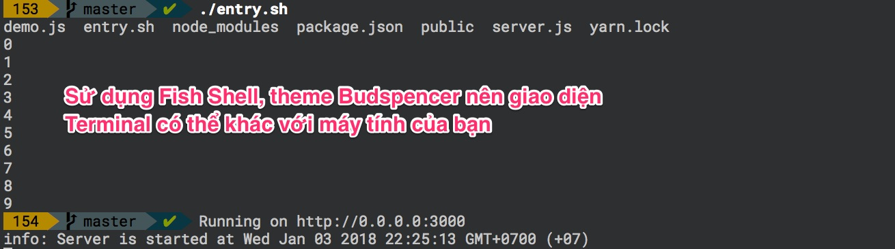

# Demo Dockerize Node.js application

Lấy mã nguồn về
```
git clone https://github.com/TechMaster/DockerNodeApp.git
cd DockerNodeApp
```

**xem mã nguồn bài 1**
```
git checkout v1.0
cd myweb
yarn install
node server.js
curl http://localhost:3000
```
**xem mã nguồn bài 2**
```
git checkout v2.0
cd myweb
./entry.sh
```


**xem mã nguồn bài 3**
```
git checkout v3.0
cat Dockerfile
cat buid.sh
```
